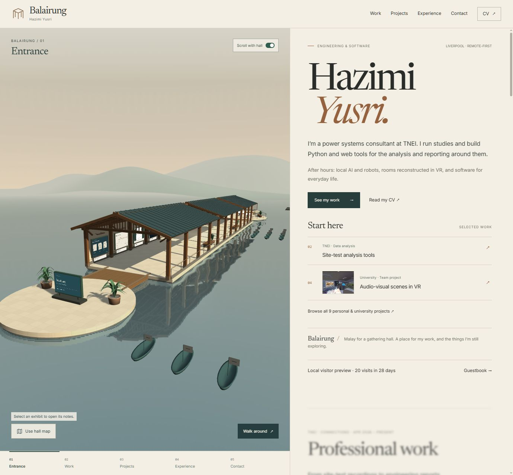
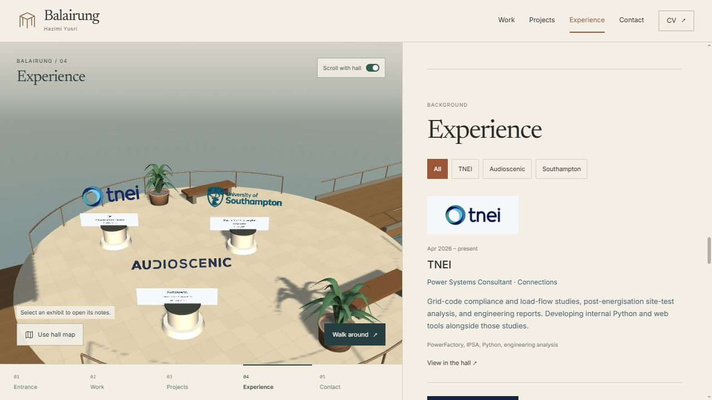
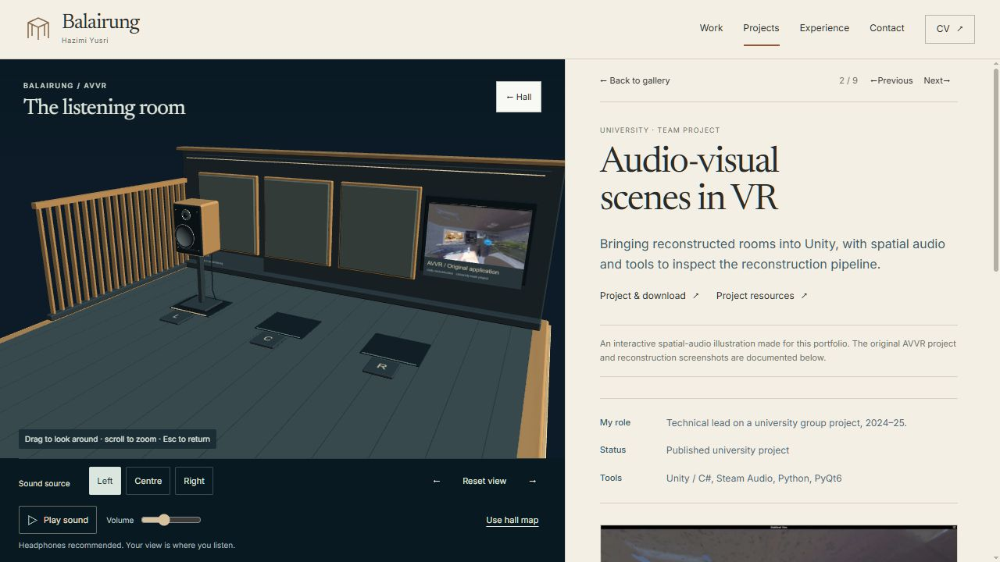
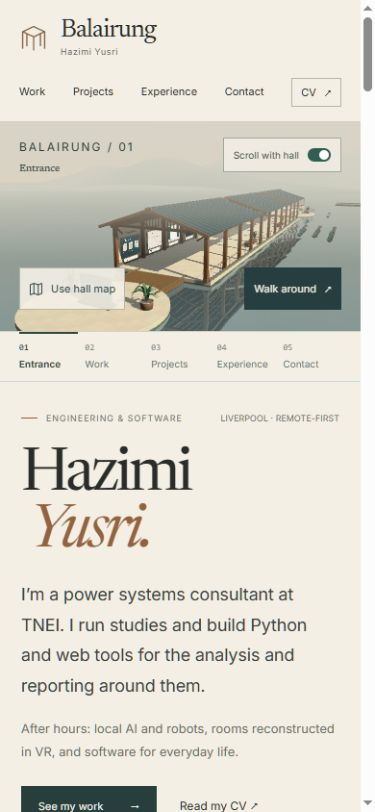

# Hall surfaces, planting and wayfinding — local review

This pass continues `codex/hall-display-polish`. The environment now has
consistent surface scale, a clearer entrance composition, static planting,
and readable experience logos. Walk entry and the location strip account for
the new geometry. The wider visual goal and owner acceptance remain open.
No commit, push, PR, issue change, merge, deployment or DNS change was made.

## Identifiable build

- Base commit: `44c38295939ab18e06559859b7bfb337d1276cf5`, plus working changes.
- Entry: `assets/index-D2_7A_-D.js`.
- CSS: `assets/index-BDXPu5D8.css`.
- Browse scene: `assets/HallScene-C5rGArYx.js`.
- Walk wrapper: `assets/HallExperience-Btytm7Ip.js`.
- Manifest SHA-256: `5642A57A652531E3C215C9C8A9EBCF8C9AA60D26FAF6BA7996B3237C1F42E373`.
- Initial JavaScript: 223,549 bytes; 3D remains separately loaded.
- Build log: `_local/environment-build.log`.
- Open: <http://127.0.0.1:5186/?community=local#>.

## Changes

The entrance camera now includes more of the first platform and its surrounding
water. The lighting is less yellow. Limestone slabs and timber boards repeat
at a consistent world scale, rather than stretching to each platform's size.
The gallery wall has a subtle limewash surface, and the water reflection has
fine, static distortion without a continuously animated surface.

There was also a texture bug: Babylon's `DynamicTexture` constructor defaults
both wrap axes to `CLAMP_ADDRESSMODE`. Increasing the texture scale therefore
stretched edge pixels instead of repeating the intended pattern. The relevant
timber, stone, plaster, water, acoustic fabric, pegboard and carbon-weave
textures now explicitly use repeat wrapping and mipmaps. Project screenshots
and logo textures retain their intended addressing. Texture generation avoids
allocating a small temporary array for every pixel.

Six planters sit outside the central route. Pots and curved, opaque leaves
are merged into the existing static material batches. They add no animation,
transparent leaf cards, external assets, lights or shadow passes. Invisible
cylindrical collision proxies protect the pots. Both versions of the 2D plan
read these positions from `hallPlantings`, as does the safe walk-entry helper.
An aerial landing above a pot moves inward into clear walking space.

All three experience logos face the camera in the overview and settle. That
view can stop rendering, and its unnecessary Pause logos control is hidden.
Individual role views and walking retain the existing proximity tracking and
idle-motion controls.

The walking strip now uses a bordered diamond and a matching "You" legend.
Its marker clamps to the visible rail on the round end platforms, whose
geometry extends beyond the rail's axis. Runtime review also found the
portrait button overlapping both the movement hint and the location strip;
it now sits below Return to portfolio, with a clear gap between controls.

## Agent checks

- PASS: final production build, TypeScript/content/asset checks, lint and
  `git diff --check`. The existing large Babylon chunk warning remains.
- PASS: navigation checks, including 18 new landing cases at/near the six
  planters; hall layout, movement, logo geometry/motion and exhibit geometry.
- PASS in local Chromium: entrance walk entry and return; experience overview
  settles with all three logos legible; selecting TNEI restores the applicable
  animation control; the floor plan has six visible planting markers.
- PASS: walking from the experience view stays beside that platform. Jumping
  to RubyVR, pressing E, closing with Escape and returning to the portfolio
  retains the nearby RubyVR gallery position.
- PASS: opening RubyVR's notes and pressing Right opens THE FINALS with the
  5 / 9 indicator. Escape returns to `#gallery/the-finals-outfit`.
- PASS: the negative entrance position remains visible at the strip's start.
  In the final walk layout, Return spans y=16–54, the portrait button y=64–98,
  movement help ends at y=632 and the strip begins at y=640 (1280 × 720).
- PASS: listening-room entry, orbit control and return to the original AVVR
  notes; repeating surface textures were inspected visually.
- PASS at emulated 390 × 844 and 320 × 740: no horizontal document overflow;
  the main scene buttons are 44 pixels high. The narrow floor plan retains
  six planting markers. These are desktop-browser breakpoint checks, not
  physical phone input or performance acceptance.
- No production-page console errors were observed during the final route,
  walking, map and island checks.

## Performance sample and limits

The profile was run through the local development page's visible controls,
using Chromium/ANGLE and an RTX 3080 at a 723 × 644 render resolution. Scene
ID: `062b9429-9b4b-40bb-8c1d-3acc46aae513`. These samples preceded the final
allocation-only texture-generation change and two walk-overlay adjustments;
the measured geometry and rendering policy are unchanged.

| Sample | Observed result |
| --- | --- |
| Settled experience overview, 6.01 seconds | 0 rendered frames, 0 long tasks, no target passes or scroll-layout work |
| Moving project gallery, 6 seconds | 1,018 frames; 169.6 fps; median frame 5.9 ms, p95 6.4 ms, p99 6.9 ms, max 14.7 ms |
| CPU / GPU frame work | CPU p95 0.9 ms; GPU p95 3.72 ms; median 33 draw calls |
| Scroll work | 1 layout measurement; 986 updates; 0 long tasks |
| Offscreen passes | 170 reflection + 170 refraction; FPV 70, PetBot 66, AVVR 145 portal passes |

Water targets remain 512 pixels, the cached shadow target 2048, and portal
targets 640 × 428. Scene totals were 181,194 triangles, 263 meshes and 67
textures: 16,968 more triangles, eight more meshes and three more textures
than the preceding gallery pass. Static batching reduces draw overhead; the
added geometry still has a cost. These figures are not Firefox, mobile,
headset, battery-life or public-deployment results, and are not comparable
to an earlier stationary-island FPS sample.

## Screenshots

The captures show the local preview, including local visitor-test data.






## Owner functional review — pending

No account is required. The preview and local visitor service are running.
Allow about five minutes for the desktop journey; device checks are separate.
If the preview needs restarting, use this in PowerShell:

```powershell
Set-Location 'E:\Coding\portfolio-hall'
npm.cmd run preview -- --host 127.0.0.1 --port 5186 --strictPort
```

Stop that process with Ctrl+C. The `community=local` query uses the local
service on port 5190. It does not publish visitor data. The base URL without
that query works for the rest of this review.

- [ ] Open the entrance URL. Judge the materials, lighting and wider view.
  Choose Walk around: you should arrive on the nearby platform with clear
  Return, portrait, movement and location controls.
- [ ] Return and choose Experience. All three logos should be readable.
  Choose TNEI, then All; the control and camera should match each view.
- [ ] Choose Walk around from Experience. You should stay by that end of
  the hall. Try walking past a planter; it should not trap you or let you
  pass through its pot. Return to portfolio.
- [ ] Open RubyVR Studio. Press Right, Left and Escape. The project title,
  position indicator and camera should agree, and Escape should return you
  to the gallery with the current project still nearby.
- [ ] Open Audio-visual scenes in VR, then Enter the island. Orbit the room,
  change the sound-source position, and Return to hall. Check the fabric,
  floor and camera feel; the project notes should remain available.
- [ ] Repeat the scroll / project / return loop in Firefox and on a physical
  phone. Check responsiveness, touch controls and visual comfort. In the map
  view, all sections and project notes should remain reachable.

User results, visual acceptance and device results are **pending**. No checks
were waived. This pass does not establish merge readiness or finish the wider
backlog. The visitor service still needs public provisioning, and the earlier
WattWhere basemap-provider finding remains open in the local review record.
