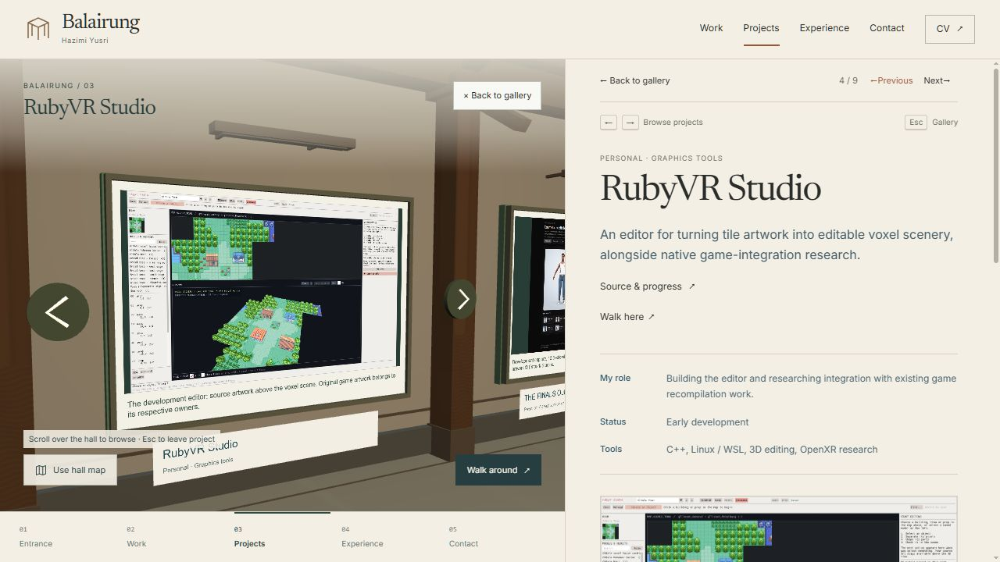
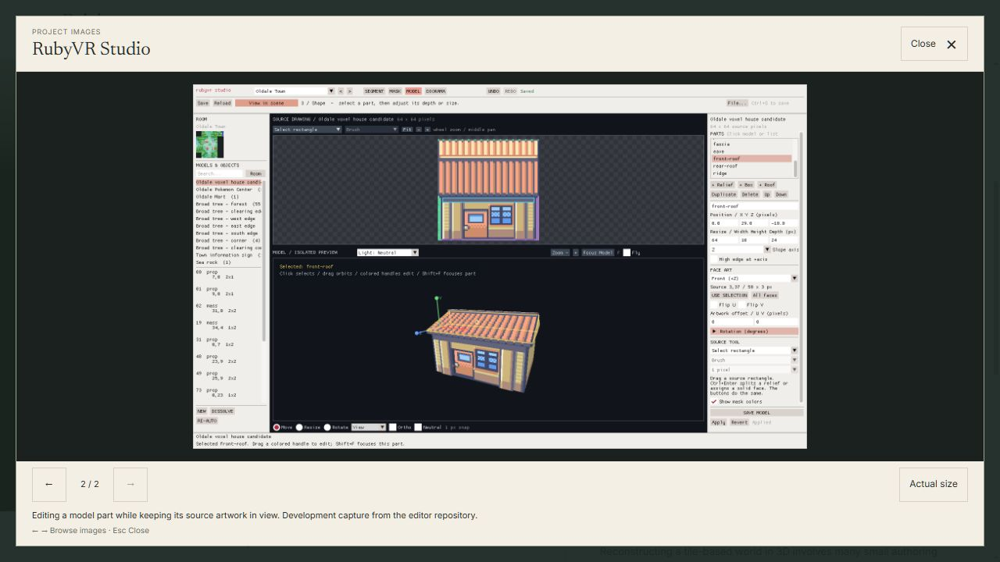
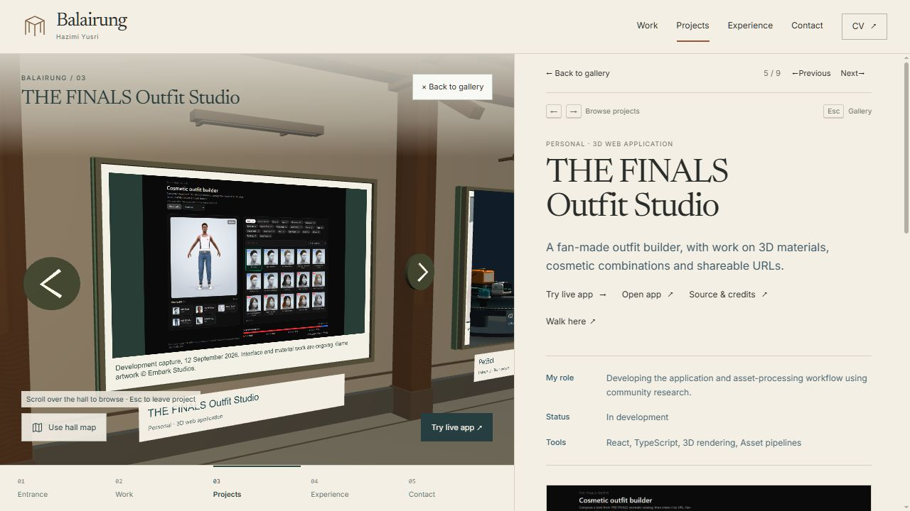

# Gallery imagery and image inspection — local review

This pass continues `codex/hall-display-polish`. It adds real project imagery
and makes those images inspectable without losing the visitor's place. The
overall visual goal and owner acceptance remain open. No commit, push, PR,
issue change, merge, deployment or DNS change was made.

## Identifiable build

- Base commit: `44c38295939ab18e06559859b7bfb337d1276cf5`, plus working changes.
- Entry: `assets/index-D5jxCQZ7.js`.
- CSS: `assets/index-D8FFQk-A.css`.
- Browse scene: `assets/HallScene-vHMLF9nf.js`.
- Walk wrapper: `assets/HallExperience-D0WxIBRh.js`.
- Manifest SHA-256: `F986BF2AFE54809DC016E572596F280EFB1435DDF1FD97258DE352C72C8FD25A`.
- Initial JavaScript: 223,144 bytes; 3D remains separately loaded.
- Build log: `_local/gallery-build.log`.
- Open: <http://127.0.0.1:5186/?community=local#project/rubyvr-studio>.

## Changes and provenance

RubyVR's frame now shows its actual editor, with the source tile map above the
voxel scene. Its notes also include a second capture of part selection and
modelling. THE FINALS frame shows the actual outfit-builder interface. Its
caption explicitly dates the development capture to 12 September 2026 and
credits Embark's game artwork. Neither project is presented as finished.

The three PNGs are copied without visual edits:

| Portfolio asset | Source in the corresponding local public project |
| --- | --- |
| `rubyvr-studio-scene.png` | `rubyvr-studio/docs/media/studio-oldale.png` |
| `rubyvr-studio-model.png` | `rubyvr-studio/docs/media/studio-part-selection.png` |
| `the-finals-outfit-builder.png` | `the-finals-outfit/_docs/catalog-progress-ui-2026-09-12/builder-desktop.png` |

SHA-256, in the same order:

```text
B41C98EAFCA6D7227E586641DC05B0DD07B94F026C690C7299CE6A0496A64C6C
C32C7DCCF29BEAF99A8697CB27408667BDEFA0F7FF8779E2438092B71A5A79DA
89999BE814D9F56032664704D0111E6D3CD4685622199118E1846A99AE4AFC07
```

The total is 608,747 bytes. The secondary RubyVR image loads when selected;
the hall continues to use one existing texture per frame. Frames now have a
slimmer dark edge, and the physical project arrows have a subdued material.
There are no new shadow passes or continuous display animations.

All existing project images can open in a native dialog. Additional `gallery`
images are selected manually. The viewer provides actual-size scrolling,
captions, arrow controls, keyboard navigation, a visible Close button and
Escape. It preserves reading position and returns focus to the image button.
The hall's render callback suspends while the dialog covers it.

### Keyboard defect caught during testing

The first implementation used native disabled next/previous buttons. Clicking
Next at the last image caused Chromium to focus the document body; Left then
changed the project from RubyVR to WattWhere and dismissed the viewer. The
final version retains focus with `aria-disabled`, ignores out-of-range image
requests and blocks hall shortcuts whenever any modal dialog is open. Tab and
Shift+Tab also wrap within the viewer's controls.

## Agent checks

- PASS: production build (including TypeScript and content/asset checks), lint,
  existing contextual-navigation checks and `git diff --check`. The existing
  large Babylon chunk warning remains.
- PASS in Chromium on the final build: Next to image 2 retains focus; repeated
  Left stops at image 1, repeated Right stops at image 2, and the RubyVR route
  stays unchanged. Escape restores the Enlarge button; Right then moves to
  THE FINALS as expected.
- PASS: actual-size scrolling, image selection resetting the view, close and
  reopen, and single-image projects showing only the relevant controls.
- PASS: keyboard focus wraps from Close backward to Actual size and forward
  to Close. No production-origin console errors were observed.
- PASS at 390 × 844 and 320 × 740: the dialog fits the viewport, no horizontal
  document overflow, and controls are at least 44 × 44 pixels. Full-size image
  overflow stays inside the viewer. Closing preserved mobile scrollY 689 and
  restored focus without changing the route. These are emulated dimensions,
  not physical phone acceptance.
- A six-second development sample begun immediately before opening the dialog
  counted 47 frames despite the forced-awake option. This combined transition
  sample includes frames before the viewer opened; it is not an isolated
  steady-state FPS result or a Firefox/mobile performance claim.

Desktop screenshots below are from the final build. The phone screenshot
records the unchanged 390-pixel layout immediately before the final keyboard
boundary repair.





## Other finding

The public WattWhere dashboard showed repeated "API KEY REQUIRED" watermarks
on the basemap during this review. Its data overlays and charts were present.
That provider problem needs investigation in WattWhere; the portfolio does
not hide it in a fabricated screenshot. No changes were made in that repo.
WattWhere and Balairung still have their existing diagram-style frames.

## Owner functional review — pending

No account is needed. The preview is running locally. If it needs restarting:

```powershell
Set-Location 'E:\Coding\portfolio-hall'
npm.cmd run preview -- --host 127.0.0.1 --port 5186 --strictPort
```

Stop that preview with Ctrl+C. The `community=local` option uses the already
running local visitor service; it is not required for the image viewer.

- [ ] Open RubyVR at the URL above. Its hall frame should show the actual
  editor, with readable notes on the right. Judge the imagery and frame design.
- [ ] Choose Enlarge image, then Next image. Press Left twice and Right twice.
  Only the two images should change; the project should remain RubyVR.
- [ ] Choose Actual size and scroll around the screenshot. Choose Fit image,
  then Escape. The same reading position should return. Open/close once more.
- [ ] With the viewer closed, press Right. THE FINALS and the 5 / 9 indicator
  should appear. Open its image: it should have a dated caption and no unused
  previous/next buttons.
- [ ] Return to RubyVR with Left, then choose Walk here. You should arrive by
  its frame. Return to portfolio should reopen RubyVR; Escape should return to
  the gallery rather than trap you in project focus.
- [ ] Repeat the image/close/project loop in Firefox and on a physical phone.
  Check scrolling, sharpness, touch targets and whether camera movement feels
  comfortable. Browser emulation does not check those devices for you.

User results, visual acceptance and device results are **pending**. No checks
were waived. This pass does not establish merge readiness or complete the
larger portfolio backlog.
